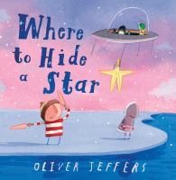

### Week One

|                                                                                                                                                                                                                 |                                             |                         |                |               |                |
| --------------------------------------------------------------------------------------------------------------------------------------------------------------------------------------------------------------- | ------------------------------------------- | ----------------------- | -------------- | ------------- | -------------- |
| **Image**                                                                                                                                                                                                       | **Name**                                    | **Author**              | **Rate**       | **Price**  | **Read Date**  |
|                                                                                                                                                                                             | Where to Hide a Star                        | Jeffers, Oliver      | ⭐️⭐️⭐️⭐️⭐️     | 24.99      | 2026/04/24  |
|                                                                                                                                                                                         | The Giant Hug                            | Horning, Sandra      | ⭐️⭐️⭐️⭐️       | 8.99       | 2026/04/24  |
|                                                                                                                                                                                         | Flooded                                  | Ilustrajo, Mariajo   | ⭐️⭐️⭐️⭐️⭐️  | 24.00      | 2026/04/24  |
|                                                                                                                                                                                         | The Dictionary Story                     | Jeffers, Oliver      | ⭐️⭐️⭐️⭐️⭐️  | 24.99      | 2026/04/25  |
|                                                                                                                                                                                         | The Book From Far Away                   | Handy, Bruce         | ⭐️⭐️⭐️⭐️⭐️  | 24.99      | 2026/04/25  |
|                                                                                                                                                                                         | I Promise                                | James, LeBron        | ⭐️⭐️⭐️      | 24.99      | 2026/04/25  |
|                                                                                                                                                                                         | No No, Baby!                             | Hunter, Anne         | ⭐️⭐️⭐️⭐️    | 23.99      | 2026/04/26  |
|                                                                                                                                                                                         | Paper Planes                             | Helmore, Jim         | ⭐️⭐️⭐️⭐️⭐️  | 17.99      | 2026/04/26  |
|                                                                                                                                                                                         | Pigs Dig A Road                          | Finison, Carrie      | ⭐️⭐️⭐️⭐️    | 24.99      | 2026/04/26  |
|                                                                                                                                                                                        | Sometimes It's Nice to Be Alone          | Hest, Amy            | ⭐️⭐️⭐️      | 24.99      | 2026/04/27  |
|                                                                                                                                                                                        | Giraffe and Bird                         | Bender, Rebecca      | ⭐️⭐️⭐️⭐️    | 19.95      | 2026/04/27  |
|                                                                                                                                                                                        | Grow Up, David!                          | Shannon, David       | ⭐️⭐️⭐️⭐️    | 22.99      | 2026/04/27  |
|                                                                                                                                                                                        | 红狐狸                                   | 安旭                 | ⭐️⭐️⭐️⭐️    | 23.25      | 2026/04/28  |
|   | I'm Brave! I'm Strong! I'm Five!         | Best, Cari           | ⭐️⭐️⭐️⭐️⭐️  | 24.99      | 2026/04/28  |
|                                                                                                                                                                                        | Little Juniper Makes It Big              | Cassie, Aidan        | ⭐️⭐️⭐️⭐️⭐️  | 23.50      | 2026/04/28  |
|                                                                                                                                                                                        | My Teacher Is A Monster! (no, I Am Not)  | Brown, Peter         | ⭐️⭐️⭐️⭐️⭐️  | 20.00      | 2026/04/29  |
|                                                                                                                                                                                        | Nervous Nigel                            | Christou, Bethany    | ⭐️⭐️⭐️⭐️⭐️  | 24.99      | 2026/04/29  |
|                                                                                                                                                                                        | Goodnight Moon                           | rown, Margaret Wise  | ⭐️⭐️⭐️      | 20.89      | 2026/04/29  |
|                                                                                                                                                                                        | Poultrygeist                             | Geron, Eric          | ⭐️⭐️⭐️⭐️⭐️  | 22.99      | 2026/04/30  |
|                                                                                                                                                                                        | There, There                             | Beiser, Tim          | ⭐️⭐️⭐️⭐️⭐️  | 21.99      | 2026/04/30  |
|                                                                                                                                                                                        | What's Love All About, Minimoni?         | Bonilla, Rocio       | ⭐️⭐️⭐️⭐️    | 29.5       | 2026/04/30  |

 
