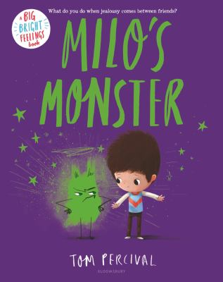

A List of Children's Picture Book | Week 2

 

### Week 

|     |     |     |     |     |     |
| --- | --- | --- | --- | --- | --- |
| **Image** | **Name** | **Author** | **Rate** | **Price**  | **Read Date** |
|  | Milo’s Monster | Percival, Tom  | ⭐️⭐️⭐️⭐️⭐️ | 23.99 | May 1, 2026  |
|  | Olive & Pekoe - In Four Short Walks  | Davis, Jacky  | ⭐️⭐️⭐️ | 21.99 | May 1, 2026  |
|  | Frankie's Favorite Food | Garrity-Riley, Kelsey  | ⭐️⭐️⭐️⭐️  | 21.99 | May 1, 2026  |
|  | The Love Letter | Denise, Anika  | ⭐️⭐️⭐️⭐️  | 21.99 | May 2, 2026  |
|  | Stella, Queen of the Snow  | Gay, Marie-Louise  | ⭐️⭐️⭐️⭐️⭐️  | 15.95 | May 2, 2026  |
|  | Stella, Star of the sea  | Gay, Marie-Louise  | ⭐️⭐️⭐️⭐️⭐️  | 7.95 | May 2, 2026  |
|  | A sick Day for Amos McGee | Stead, Philip Christian  | ⭐️⭐️⭐️⭐️  | 19.99 | May 3, 2026  |
|  | A Child of Books | Jeffers, Oliver  | ⭐️⭐️⭐️⭐️  | 22.00 | May 3, 2026  |
|  | The Snow Lion | Helmore, Jim  | ⭐️⭐️⭐️⭐️  | 23.95 | May 3, 2026  |
|   |   |   | ⭐️⭐️⭐️  |   |   |
|   |   |   | ⭐️⭐️⭐️⭐️  |   |   |
|   |   |   | ⭐️⭐️⭐️⭐️  |   |   |
|   |   |   | ⭐️⭐️⭐️⭐️  |   |   |
|   |   |   | ⭐️⭐️⭐️⭐️⭐️  |   |   |
|   |   |   | ⭐️⭐️⭐️⭐️⭐️  |   |   |
|   |   |   | ⭐️⭐️⭐️⭐️⭐️  |   |   |
|   |   |   | ⭐️⭐️⭐️⭐️⭐️  |   |   |
|   |   |   | ⭐️⭐️⭐️  |   |   |
|   |   |   | ⭐️⭐️⭐️⭐️⭐️  |   |   |
|   |   |   | ⭐️⭐️⭐️⭐️⭐️  |   |   |
|   |   |   | ⭐️⭐️⭐️⭐️  |   |   |

 