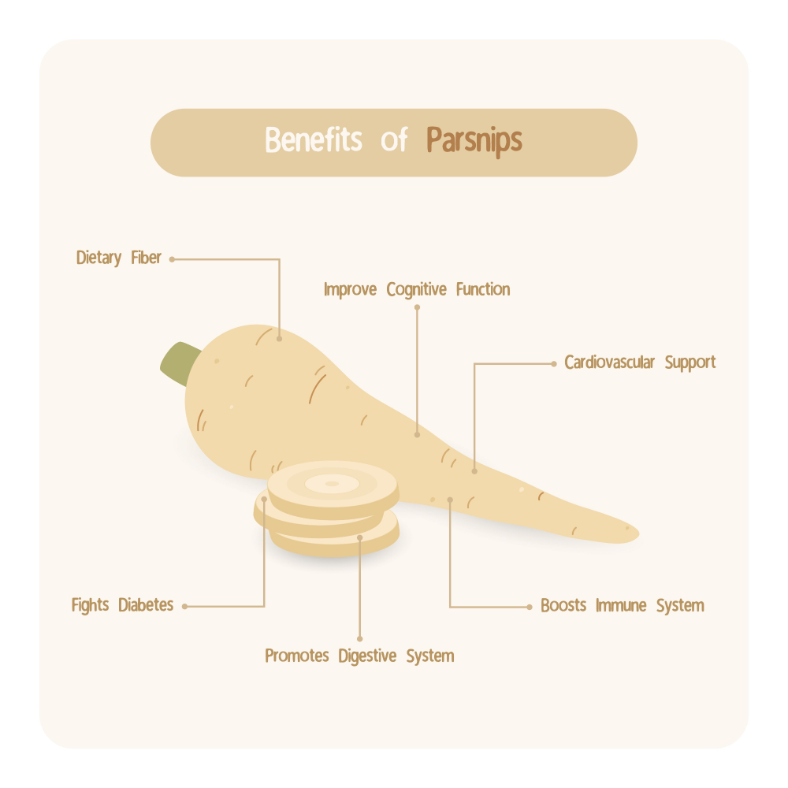

## 每日故事

#绘本翻翻乐\[话题\]# #爸爸讲故事\[话题\]# #宝宝英文启蒙绘本\[话题\]# #幼儿故事\[话题\]# #睡前故事书\[话题\]# #绘本\[话题\]# 

 

Week2

### Day 10 A sick Day for Amos McGee / A Child of Books / The Snow Lion

1. A sick Day for Amos McGee —  Philip Christian Stead
    - Amos McGee, a friendly zookeeper, always made time to visit his good friends: the elephant, the tortoise, the penguin, the rhinoceros, and the owl.But one day -- Ah-choo! -- he woke with the sniffles and the sneezes. Though he didn't make it into the zoo that day, he did receive some unexpected guests.
    - 读后感：这是一本有温度的故事书。前半段描写了 Amos 极具秩序感的生活方式，体现出他对手中生活的尊重和对他人的认真。他不仅仅是在动物园工作，更是在用心经营着与动物们的每一段羁绊：陪大象下棋（即使大象要思考很久），陪乌龟赛跑，陪企鹅发呆，陪猫头鹰熬夜。他的爱具体且充满尊重。所以当他生病后，读者和动物们一样，都会产生一种急切的挂念。这个故事完美地诠释了：你怎样温柔地对待世界，世界就会怎样温柔地对待你。
    - 短句词汇：  
AMOS MCGEE was an EARLY RISER.  
Every morning when the alarm clock **clanged**(当当响、敲响、发出金属撞击声), he **swung** his legs **out** (甩出、荡出、利索地翻出) of bed and **swapped** his pajamas **for** (换掉、替换) a **fresh-pressed**(熨烫平整的、笔挺的、如新的)  uniform.  
He would **wind**(拧、绕、上发条) his watch.  
Belly full and ready for the workday, he'd **amble**(它不是普通的`walk`或`run`，而是一种轻松、不慌不忙、甚至带点悠哉游哉的走法) out the door.  
One day Amos awoke with the **sniffles**(吸鼻子、流鼻涕), and the **sneezes**(打喷嚏), and the **chills**(发冷、打冷战、寒颤).  
The elephant **arranged his pawns** (摆放棋子) and **polished his castles**(擦拭他的“城堡”). The tortoise stretched his legs and **limbered up**(热身、活动筋骨、使身体柔软). The owl **perched**(栖息、立在、蹲坐在-高处) **atop**(在……顶端) a tall stack of storybooks, scratching his head with concern.
2. A Child of Books - Oliver Jeffers
    - A little girl, a child of books, sails her raft across a sea of words and arrives at the house of a young boy. She invites him to go away with her on an adventure into the world of stories… where, with only a little imagination, anything at all can happen.
    - 读后感：

因为特别喜欢作者的另一部作品《字典的故事》（_The Dictionary Story_），我顺着线索发现了这本书。

自古我们常说“书中自有颜如玉，书中自有黄金屋”，但这话对孩子来说未免太晦涩。而《书之子》则用极其形象的方式，向孩子展示了书里的山川、海洋、云朵和城堡。在共读时，多亏了孩子的提醒——他总是能在看书时不漏掉任何一个细节和可读的内容——我才仔细观察到，那些风景竟然全是由经典文学作品的文字排版而成的（盯着那些粗体字看，就能发现一个个熟悉的故事名）。

这让我深刻感受到，**书籍不仅仅是纸张，它构成了我们灵魂居住的世界。** 每个人都会收到“书之子”的邀请，只要你愿意翻开它，那个广阔的、永远不会因为现实而枯竭的世界就属于你。

如今在这个嘈杂浮躁的社会里，还有多少人能拿起一本纸质书，坐在角落慢慢地品读呢？
    - 短语词汇：  
We will travel over mountains of make-believe(幻想、假装游戏).  
We can lose ourselves in forests of fairy tales (童话) and escape monsters in haunted (闹鬼的、阴森森的) castles.

### Day 9 The Love Letter / Stella, Queen of the Snow / Stella, Star of the sea

1. The Love Letter — Anika Denise
    - Stumbling on the same mysterious love letter in turn, best friends Hedgehog, Bunny, and Squirrel are reminded of the joys of friendship following a silly mix-up about their secret admirer.
    - 短句词汇：  
It further **frazzled** (原意是磨损、疲惫，这里形容情绪被“磨得快断了弦”，译为**心烦意乱**或**抓狂**) his already **prickly mood** (这里的“prickly”像仙人掌一样扎人，形容人易怒、满身带刺). He’d been **grumbling about it to the ground** (这是一个很形象的动作，描写人低着头、避开他人视线，对着地碎碎念或嘟囔) when…  
He **came across** (偶然发现”或“不期而遇) on his **daily walk** (日常散步).  
Then he **tucked** (“揣”或“塞”) the letter into his backpack and went on his way.  
Bunny and Squirrel were already in the **meadow** (“草地”或“原野”).  
When bunny beat him at leap log (跳木桩 — 由 Leapfrog”跳马游戏/跳青蛙”演变而来的词)?  
Today, he had a love letter and was feeling **oddly** (“奇怪地”或“出人意料地”) **cheerful** (破天荒地兴高采烈) .  
Normally Bunny pretended to nap at **chore time** (做家务的时间), but today she had a love letter and aws feeling oddly… helpful.  
When Mama said peel the **parsnips** (“欧防风” 或 “欧洲萝卜”)?   
  
When papa said sweep (打扫，清扫) the floor? Splendid (这是一个语气非常强烈且优雅的赞叹词，译为“太棒了！”、“好极了！”或“太出色了)!  
Before he could say **Thanks a bundle** (这是一个非常地道的口语表达，bundle 原意是“捆、包”，这里形容感谢之情非常多), Bunny overturned her **apronful** (指“围裙兜着的量”) of acorns onto **the pile** (那堆东西).  
Squirrel's **neatly stacked** (堆叠得整整齐齐) acorns **came tumbling down** (⁠哗啦啦全都倒了或轰然倒塌)!  
He spotted something unusual among the acron **scatter** (物体向四面八方散开).  
The next morning, Hedgehog, Bunny, and Squirrel **bundled up** (穿得暖暖和和的或裹得严严实实**)** and headed to the meadow.  
And on it went: **snatch** (猛抓/夺), **grab** (一把抓住), **steal** (偷走/顺手牵羊), **bicker** (斗嘴或吵架**)**.  
Mouse looked at their long faces (一个非常经典的英语习语。字面意思是“长脸”，但实际指“拉长了脸”**、**“表情忧郁”**或**“垂头丧气”).  
    - 读后感：

这是一本非常温馨、幽默，又带着一点“乌龙”色彩的绘本。当一封匿名的情书在森林小动物间传开，随着心情的转变，它们的行为也发生了奇妙的变化：原本焦虑的变得平和，原本沮丧的变得阳光。这就是“被爱”的心理暗示所拥有的强大治愈力。

其实，我们并不一定非要等到这样一封“乌龙信”才会快乐，心中只要保有“爱与被爱”的希望，本身就能让我们变得更温柔。

回看自己的成长背景，受家庭和传统教育的影响，我一直是一个不太擅长表达爱的人。无论是对朋友、亲人还是爱人，我总是习惯默默去做，却往往忽略了言语上的表达。

但现在，每天和孩子骑车上下学的路上，他总会直白地对我说：“爸爸，你知道吗？你是我在这个世界上最爱的人，我希望能一直陪着你。”而我也能坦然地回应他：“你知道吗？你也是爸爸最爱的人。从你出生到现在，我一天都没有离开过你，我会好好爱你每一天的！”

如果换作年轻时的我，怎么也想不到自己能说出这么“肉麻”的话。但现在我明白了：**爱不仅需要行动的深沉，也需要大声说出来的热烈。**

2. Stella, Star of the sea — Marie-Louise Gay
    - Stella and her little brother are speding the day at the sea. Stella has been to the sea before and knows all its secrets, but Sam has many questions.  
“Where do starfish come from? Does a catfish purr? Does a sea horse gallop?”  
Stella has an answer for them all. The only thing she isn’t sure of, and neither are we, is whether Sam will ever come into the water.
    - “Do you think there are sharks in the sea?” asked Sam. “Have you ever seen one?” “Just a little one,” said Stella, “with an **eyepatch** (眼罩)”.“Does a sea horse neigh?” asked Sam. “Does a sea horse **gallop** (飞奔)?” “Yes!: cried Stella. “And you can ride a sea horse **bareback** (光着马背). Come on in, Sam!”
    - 读后感：

大名鼎鼎的“Stella and Sam”系列，之前读绘本时还没太大感觉。直到最近孩子看完了同名动画片，我才发现这真的是宝藏，还一股脑推荐给了身边所有带娃的朋友。

读完这本《Stella, Star of the Sea》，心里暖洋洋的。孩子爱得不行，甚至开始向往能有个姐姐，这几天一直追着我问：“我能不能有个姐姐呀？”我只能无奈地告诉他：“如果可能的话，你大概率只能有弟弟或者妹妹。”

书里的 Sam 实在是太可爱了。他第一次见到大海时的那种恐惧和局促，瞬间勾起了我的回忆。记得我第一次见大海还是在12岁，坐了十几个小时的绿皮车才晃悠到日照。相比之下，我的孩子就幸运多了，两岁多就在“红发安妮”的家乡亲近了大自然。说起来，书里的 Stella 也是一头红发，还真是一种奇妙的缘分。

Sam 对大海的畏惧，让他变成了一个“问题少年”。他问海星是不是天上的星星，问海马能不能骑，其实是在用自己熟悉的小世界去试探那个陌生的大世界。我也经历过孩子的“十万个为什么”阶段，那种每句话都要被追问到底的“烦人劲儿”，真的挺考验耐心。

相比之下，Stella 真的比我优秀太多。面对山姆每一个稀奇古怪的问题，她都给出了天马行空的回答。她从不否定弟弟的胆怯，也不会用大人的口气说“这有什么好怕的”。她只是自己像个精灵一样在海里嬉戏，用纯粹的快乐去勾引山姆的好奇心。这种“不催促的陪伴”，确实是我们成年人最难修通的分寸感。

3. Stella, Queen of the snow — Marie-Louise Gay
    - Winter was never so magical as in this marvelous book about Stella and Sam discovering a familiar landscape transformed by a heavy snowfall. It is Sam’s very first snowstorm and, as usual, he has lots of questions.  
“Where do snowman sleep? Can you eat a snowflake? Do snow angels sing?"  
Older and bolder, Stella knows all the answers, and she delights in showing Sam the many pleasures of a beautiful winter’s day. Stella and Sam build a gigantic snowman then go skating and sledding and make beautiful snow angels in a fluffy white, magical and wondrous world.
    - “Where does a snowman sleep?” asked Sam. “In a soft, fluffy **snowbank** (指由于风吹或清扫而堆积起来的、像小山坡一样的厚雪堆),” answered Stella.  
“What does a snowman eat?” asked Sam. “Snowballs…” sang Stella, “snow peas… and snowsuits (厚冬装, 通常指那种防风防水、甚至带有帽子的连体冬衣).”  
“Where is the water?” asked Sam. “The water is frozen,” Said Stella, “like a giant silver **popsicle** (冰棒” 或 “冰棍).”  
Lets build a **fort** (堡垒).  
“Do birds get **goosebumps** (鸡皮疙瘩)?” asked Sam. “No,” said Stella. “Birds wear snowboots.”
    - 读后感：

读到第一页，我就忍不住想找个“Bug”：Stella 和 Sam 设定上是加拿大的孩子，家在 Manitoba（曼尼托巴），四岁的 Sam 怎么可能现在才第一次见雪？这在加拿大简直不可思议。

不过撇开逻辑，雪本身确实迷人。我至今仍深深热爱着雪后的清晨，整片世界银装素裹，干净得一尘不染。我最享受那种感觉：把全副武装的孩子放在雪板上，在没人走过的厚雪里踩出“咯吱咯吱”的声音，亲手开辟出一条新路。回头望去，那道长长的雪板印，真的是生活里特别畅快、特别解压的瞬间。**有时我也会调皮地突然一抽雪板，看着孩子“扑腾”一下坐到雪堆里，那才是冬日里最生动的快乐。**

当然，在加拿大生活久了，讲真的，对雪也难免生出几分“恨”。可能等哪天我老到实在铲不动雪了，这种讨厌会更真切吧。

书里的 Sam 依旧问着各种天马行空的问题，Stella 也依旧展示着她那教科书级的“护航式”陪伴。看着 Sam 步履蹒跚地探索，Stella 热情奔放地玩耍，我脑子里突然冒出一个念头：在 Stella 还小的时候，她是不是也像Sam这般小心翼翼？那时候，又是谁来回答她的那些“为什么”呢？

有趣的是，我孩子读的时候也发出了同样的灵魂拷问：“爸爸，他们的爸爸妈妈在哪儿呢？”

### Day 8 Milo’s Monster / Olive & Pekoe - In Four Short Walks / Frankie's Favorite Food

1. Milo’s Monster - Percival, Tom
    - Milo and Jay have always been best friends… until, one day, a green-eyed monster ruins everything!  
Milo loves spending time with his best friends, Jay. But when a new girl named Suzi moves in next door, Milo starts to feel left out. The jealous feeling gets stronger and stronger — until suddenly, a GREEN-EYED MONSTER pops up beside him soon, the monster is twisting up all of Milo’s thoughts and making him feel sad. It won’t eave him alone!  
Can Milo find a way to free himself from the monster and repair his friendship?
        - 心得体会：

Tom Percival 的 “Big Bright Feelings” 系列真的非常出色。今天和孩子一起读了这本《Milo’s Monster》，刚好借这个机会探讨了“嫉妒”这种复杂的情绪。

“嫉妒”其实挺抽象的，但书里把它比作一个“绿色的小怪物”，孩子立刻就理解了——原来那种酸溜溜的感觉，就是心里住进了一个爱捣蛋的小家伙。至于为什么是绿色的？我想应该是源于英文里 “Green with envy” 这个表达。

我们要让孩子知道，情绪是会在心里慢慢生长的，如果不及时沟通，它可能就会反过来控制你。所以，我们必须正视它：嫉妒并不可耻，关键在于怎么去处理它。还有很重要的一点是，友情并不是独占，而是可以分享的。多一个朋友，并不会减少原有的爱。

    - Milo lived in a **neat** (整洁的、井井有条的) little house on a neat little street.   
A funny feeling **squirmed** (蠕动、扭动) around in Milo’s tummy.  
And whenever he saw them playing… the monster **hissed** (发出嘶嘶声 / 愤怒地低声说 \[hiss 的过去式\]) that they were having more fun without him.  
Day after day, he walked around with only the **miserable** (痛苦的 / 惨淡的 / 极其糟糕的 / 令人沮丧的, 这个词比普通的 "sad”要沉重得多。它形容一种从内心深处感到绝望、不快乐，或者是环境极度恶劣让人无法忍受的状态) mutterings of the green-eyed monster for company.  
The green-eyed monster **protested** (抗议 / 反对 / 申辩) and muttered mean words — but its voice became quieter and quieter, and quieter, until at last it was completely GONE.
2. Olive & Pekoe In Four Short Walks - Jacky Davis
    - Olive and Pekoe are best friends.  
Olive is old and very knowledgeable.  
Pekoe is young and very enthusiastic.  
Olive is small and slow.  
Pekoe is big and bouncy.  
Still, even though these dogs are opposites in almost every way, they each appreciate the other and enjoy wonderful walks together, including the four eventful excursions in this book.
    - 短句和词语：  
Pekoe is **bouncy** (活蹦乱跳的 / 充满活力的) puppy who loves to run.  
Pekoe, **ought to** (应该、应当带有某种道德责任感或合理性建议**)** slow down and wait for her.  
Pekoe **adores** playing with sticks.  

> **Like**: 喜欢（普通程度）。
> 
> **Love**: 热爱（很强的感情）。
> 
> **Adore**: **酷爱 / 疼爱 / 崇拜（带有情感上的沉溺）**。
> 
> **Be obsessed with**: 痴迷（近乎疯狂，有时带点负面）。

Olive just looks at it, but she appreciates the **gesture** (姿态 / 手势 / 心意).  
When the clouds darken and **rumble** (⁠⁠⁠⁠低沉、持续) **with thunder** (一阵隆隆的雷声), Pekoe **shudders** (不寒而栗 / 战栗 / 剧烈抖动) and aims one brave bark at the noisy sky.  
A sharp wind **blasts** **(猛烈吹袭 / 轰击)** Olive.  
She **regrets** (后悔 / 遗憾 / 惋惜) leaving home on this stormy day.  
Cold **sheets of rain** (成片的雨 / 倾盆大雨) **drench** (使湿透 / 浸透 / 淋漓)  Pekoe's fur. **Stunned** (目瞪口呆 / 震惊) at this **terrible turn of events** (糟糕的情势逆转), he hides behind a **bush** (灌木).  
Pekoe is **soaking wet** (浑身湿透) and tries to shake off every drop of water that is on him.  
Olive is ready to go home to her **cozy pillow** (舒适的枕头).  
With **soggy** (湿透的 / 软塌塌的) ears and a **sagging** (下垂；松弛；\[由于压力或重量\]向下弯曲) tail.  
Olive **blinks** (眨眼 \[blinks 为第三人称单数形式\]) the rain away from her eyes.  
Olive is not impressed to see **chipmunk** (花栗鼠) **darting** (飞速移动 / 急冲) through the leaves.   
Olive isn’t overly concerned about the chipmunk’s **whereabouts** (下落；行踪；所在之处).  
Olive can observe the dogs perfectly from her **shady spot** (阴凉处 / 遮荫处).  
Pekoe is bothered by some of their rough behavior (粗鲁的行为 / 蛮横的行为).  
Pekoe **attempts to** (尝试；试图) get away from a mean dog, but the dog blocks his path.  
Pekoe is **relieved** (欣慰的；松了一口气的；舒心的) when the bully leaves him alone.
    - 读后感：

起初读这本书时，觉得平淡得近乎“无聊”——不过是讲了两只狗的四次散步。可当我静下心来细细品味，才发现这何尝不是我和孩子生活的缩影呢？

**Walk One：** 当我和孩子漫步在小树林，他跑前跑后，捡起石头当宝石，拾起树枝当宝剑。而我就像那只老狗 Olive，只是静静地坐着、依着、站着，无声地陪着。

**Walk Two：** 大雨过后，孩子穿上雨衣雨靴，兴奋地在水坑里乱蹦乱跳；而我，只想在这样的雨天钻进被窝美美睡上一觉。

**Walk Three：** 走进树林深处，他看到各种小动物便兴奋不已，追着想看个究竟。我则在一旁反复叮嘱：要注意安全，要学会静静观察，不要打扰它们。

**Walk Four：** 在Playground，除了确保他的安全，我便不再过多干预。他总要学会如何独立与小朋友相处，除非事态真的变得严重。

回过头看，我们何尝不是从那只活蹦乱跳的小狗 Pekoe 走过来的呢？如今我们变成了稳重的 Olive，而生命中又恰好出现了一个新的 Pekoe。

3. Frankie's Favorite Food —  Kelsey Garrity-Riley
    - Frankie is supposed to dress up as his favorite food for this year’s school play, but what if his favorite food is… all of them?And what if he can’t choose just one before showtime?
    - How could he decide between a bowl of **chowder** (巧达浓汤) and some fresh **guacamole** (牛油果酱)?  
Or pick between a strawberry tart and a **mozzarella salad** (马苏里拉奶酪沙拉)?  
“Can I be pancakes topped with tomato soup and **sprinkled** (撒；喷淋) with popcorn?”  
“Or a plate of nachos with spring rolls and **marzipan** (杏仁糖衣；杏仁膏) on top?”  
“How about a fishstick (鱼柳 / 鱼条), olive (奥莉芙), pad thai (泰式炒河粉), parmesan (帕尔马干酪), kimchi, couscous (古斯米 / 库斯库斯), pickle (腌菜 / 泡菜), hummus (鹰嘴豆泥) and cheesecake sandwish?”  
On the day of the show, the school halls **buzzed** (嗡嗡声 / 忙乱 / 兴奋) with excitement.  
“Everyone, please hold your **applause** (鼓掌；喝彩；掌声) until the end.”  
Frankie added some last-minute **garnishes** (装饰品、点缀物、配菜) **backstage** (后台的装饰).  
Frankie was very proud of how the bacon **sizzled** (培根滋滋作响).  
Billy got so **carried away** (忘乎所以 / 得意忘形) trying to **break dance** (霹雳舞) in his **burrito costume** (卷饼装), he accidentally **rolled offstage** (滚下了舞台).  
It is the **FALAFEL** (中东炸豆丸子) of the Opera (将经典的《歌剧魅影》The Phantom of the Opera巧妙地改成了“**炸豆丸子歌剧**”).  
The peas **snapped** (拍响指) along with a little beet-boxing.  
**Farfalle** (蝴蝶面) did the **foxtrot** (狐步舞). **Tortellini** (意大利馄饨) **tangoed** (探戈). Margot **twirled** (旋转) so fast, some of her **macaroni** (通心粉) flew off.  
While a bunch of fruits **belted out** (引吭高歌 / 痛快地唱出来) their song, Frankie sang along from backstage. And he was ready to help in case anyone **forgot their lines** (忘词).  
Frankie ran around grabbing up **scraps** (碎片、余料、残羹剩饭).   
“I am **leftovers** (剩菜)!”
    - 读后感：

这本书讲的是孩子们要扮演成自己最喜欢的食物去参加学校表演。读到这里，我一下就想到了我那热爱“变装”的孩子，他平时就特别喜欢 cosplay，恐龙、南瓜、机器人……全是他的心头好。

有趣的是，孩子现在的性格和书里的主人公简直一模一样——完全没有“选择困难症”，因为他“什么都要”。你问他两个里更喜欢哪一个？他会说都喜欢；问他想吃哪一个？他会说都要吃。这种纯粹的贪心，其实也是一种对世界满满的热爱吧。

书中满屏都是关于味道、质感、气味和食材的词汇，像 **crispy**（酥脆）、**saucy**（多汁）、**syrupy**（甜腻）等等，读下来确实让词汇量涨了不少。

合上书，我想起了一段小时候的往事。记得那时学校办演出，我们的脸蛋都涂的红扑扑，班里有个个子特别高的同学，因为在台上太扎眼，老师就把他安排在台下干打杂、看书包之类的活儿。现在回想起来，那种做法其实挺过分的。也不知道那个高个子同学，当初心里会不会介意呢？

* * *

 
Week1

### Day 7 Poultrygeist / There, There / What’s love all about, Minimoni?

1. **Poultrygeist** — _Eric Geron_
    - Why did the chicken cross the road?  
To get the other side of course.  
How did the chicken cross the road?  
Without looking both ways, sadly.  
Where is the chicken now?  
On THE OTHER SIDE, of course.
    - CAN 22.99
    - 心得体会：

这本书成了我家最近的“点读王”，哪怕占用每日故事的额度，儿子也坚持非它不可。它以幽默的方式为孩子打开了认识“另一边”（The Other Side）——即死亡世界的一扇窗。书中巧妙的谐音梗，如“Cock-a-doodle-boo!”，总能让孩子乐不可支。

最有趣的是，那些各具特色的小动物幽灵彻底俘获了孩子的心，他甚至抢着要为它们配音，亲子共读的互动感瞬间拉满。

而在欢笑之余，我更看重的是那只小鸡的底线：即便身边的幽灵都在怂恿它变邪恶，它仍执着地守护内心的善良。这正是我一直想传递给孩子的观念——“勿以恶小而为之，毋以善小而不为”。在这个喧嚣的世界里，拥有独立的人格和坚守善意的勇气，是比任何笑话都更有力量的财富。
    - 词汇总结：Poultrygeist = Poltergeist(喧闹鬼)和Poultry(家禽)的谐音梗
    - 
2. **There, There** — _Tim Beiser_
    - Rabbit is feeling crabby.   
It’s raining, and he hates being stuck inside. The roof leaks, the carrots are moldy and worst of all, he stubs his toa! So he whines, he complains, he moans, he grumps… Until Bear has had enough and decides it’s time for Rabbit to learn to appreciate what he has.  
Using Noting but the lowly common earthworm as an example, Bear teaches Rabbit a lesson about taking things for granted. Something the worm knows all about…
    - CAN 21.99
    - 心得体会：

看到兔子因为屋顶漏水、胡萝卜发霉甚至踢到脚趾就大肆抱怨（whines/complains），我立刻联想到了我的孩子。每当他的诉求没被满足，就会抱着双手、嘟着小嘴，甚至放些“狠话”来试探边界。

作为家长，我虽然像大熊一样耐心讲道理、试图安抚他（There, There），但有时孩子也会“蹬鼻子上脸”。这种不断加码的要求，其实就是孩子对父母底线的反复试探。

关于大熊用蚯蚓的卑微生活来反衬兔子的幸福，虽然这种对比稍微“伤害”了蚯蚓的心，但好在蚯蚓有“两个头”可以自我安慰，这种幽默的设定也为故事增添了十足的趣味性。

3. **What’s love all about, Minimoni?** — _Rocio Bonilla_
    - Young Minimoni’s absolute favorite thing in the world to do is to go on walks with her dog Max. They understand each other perfectly. Grown-ups, however, she doesn’t really get. Especially when they talk about something called love. It’s said that love can move mountains, but love is also supposedly found in the little things. So, which is it? Is love big or small? And if love can’t be seen, smelled, or touched, how can we know what it is? Join Minimoni and Max as they set out on a fun, quirky search to answer the age-old questions: What is love?
    - CAN 29.5
    - 心得体会：

说实话，即便现在把“爱是什么”这个命题丢给一个成年人，恐怕也很难得到一个完整且确切的回答。而这本书最珍贵的地方，就在于它并不急着给出一个标准答案，而是牵着孩子的手，在生活的点滴中去“感受”爱的轮廓。

在陪伴 5 岁儿子共读的过程中，我发现书中的视野非常开阔。它不仅涵盖了那种纯粹浪漫的爱，更多的是在引导孩子理解对家人的亲情、对朋友的友情，以及对平凡生活那份热气腾腾的爱。

这也让我反思，我们在育儿修行中，有时过于执着于“教导”孩子去爱，却忘了像 Minimoni 一样去“观察”爱。爱可能藏在像大熊一样宽厚的包容里，也可能藏在对待平凡事物（哪怕是书里提到的那条蚯蚓）的善意中。正如我始终坚持的，这种对生活的热爱与对他人的善意，才是孩子人格底色中最核心的部分。

### Day 6 My Teacher Is A Monster! (no, I Am Not)  / Nervous Nigel / Goodnight Moon

1. My Teacher Is A Monster! (no, I Am Not) - Peter Brown
    - Bobby has a problem.  
You see, his teacher is a monster.   
But when Bobby runs into his teacher outside of school, he learns there is more to her than meets the eye.
    - CAN 20.00
    - Move it or lose it! (这是一句非常经典且带有催促意味的口语，通常在人们挡路或者动作太慢时使用)  
Ms. Kirby **stomped** (跺脚 / 重步行走).  
Ms. Kirby **roared** (吼叫 / 怒吼).  
No **recess** (课间休息 / 放风时间) for children who throw paper airplanes in class.  
There was an awkward silence. And then a **gust** (一阵强风 / 狂风) of wind changed everything.  
Bobby **tossed** (随手扔 / 抛) his paper airplane into the sky and it flew and it flew and it flew.  
By lunchtime, Bobby and Ms. Kirby were happy they had **bumped into** (偶然遇见-最常见的口语用法) each other.
    - 心得体会：

读完《我的老师是怪兽》，心里五味杂陈。对孩子来说，有时候我觉得自己也是那个“怪兽”。

每天从睁眼开始，我就像上满了发条：催起床、催洗漱、催吃饭、催上学；放学后盯着写作业；玩耍时盯着表催回家；睡觉前还要不停督促。在这一轮轮的“拉锯战”里，我慢慢变成了孩子眼中那个只会吼叫的怪兽。

直到有一天，孩子妈妈告诉我，孩子偷偷跟她说：“我不希望爸爸总是熊我。”

那一刻，我心里酸酸的。教育孩子真是一场磨炼心智的修行。看着时间一点点流逝，他却总是一副慢慢悠悠的样子，我是真着急啊！我也知道孩子可能还没什么时间概念，但规则就是规则：不能迟到，不能熬夜，作业也得按时完成。这些道理我讲了一遍又一遍，可效果却微乎其微。

回想过去，我也曾是在父母的督促下长大的。以前妈妈常说的那句“早起三光，晚起三慌”，如今成了我的口头禅。这或许就是一种轮回吧。

希望孩子能理解这份良苦用心，我也在努力修行，争取少点“变身”，多点耐心。

2. Nervous Nigel - Bethany Christou
    - Nigel the crocodile comes from a long line of champions. His mother was the fastest swimmer in crocodile history, and his sister was the first crocodile to get a perfect diving score. Nigel loves to swim, too. The water is his favoriate pace to float and think.But Nigel doesn’t like swimming competitions. His heart hammers when the whistle blows, and his tail trembles when he hears the shouting from the sidelines. But he doesn’t want to disappoint his family, so he never tells them how he really feels. And when they enter him in his first real competition, Nigel doesn’t know what to do. Will he ever find the courage to tell his family the truth?
    - CAN 24.99
    - Nigel came from **a long line of greats** (名门望族 / 优秀的家族). _A long line of doctors_: 医生世家。_A long line of warriors_: 武将世家。  
His sister Summer could win marathons **with her eyes shut** (闭着眼睛).  

His heart started **thumping** (砰砰乱跳). His tail started **trembling** (微微颤抖). His teeth started **chattering** (咯咯作响).  
His family was **bewildered** (感到困惑 / 茫然). 

> **Confused** 普通 弄不清楚，比如分不清左右。  
> **Puzzled** 中等像在解谜题，虽然不懂但在思考。  
> **Bewildered** **高等** **完全不知所措，感觉被信息淹没了。  
> ****Baffled** 极高 彻底难倒了，完全无法解释为什么。

Nigel's mom and brother and sisters did their best to **reassure** (使安心 / 安慰) him.
    - 心得体会：

就像那只小鳄鱼 Nigel 一样，父母的优秀往往会无意间变成孩子的压力。自我吐槽一下：“幸好我并不优秀”。但作为五岁男孩的爸爸，现阶段我在他眼里，应该还是那个无所不能、形象高大的存在吧。

其实我也经历过对父亲由敬仰到不屑，再到崇拜与理解的反复过程。所以，我对未来也做好了准备：在孩子需要我时，我会毫不犹豫地站出来，做他的榜样；在不需要我时，我会默默退到身后，给予他支持和鼓励。

我常告诉孩子，要鼓起勇气面对挑战；但我也想让他知道，如果你真的感到害怕，敢于承认自己的软弱和不喜欢，同样是一种巨大的勇气。

我始终坚信，每个孩子都有属于自己的“赛道”。我不希望他活在别人的影子下，我常对他说：“孩子，不要跟别人比，你要做的，是最好的自己。”

3. Good night Moon - Margaret Wise Brown
    - In a great green room, tucked away in bed, is a little bunny. “Goodnight room, goodnight moon.”And to all the familiar things in the softly lit room — to the picture of the three little bears sitting on chairs, to the clocks and his socks, to the mittens and the kittens, to everything one by one — the little bunny says goodnight.
    - CAN 20.89
    - a pair of **mittens** (连指手套 / 闷手儿) .  
And a comb and a brush and a bowl full of **mush** (糊糊 / 浓粥).  
    - 心得体会：  
久仰这本跨越时代的经典，特意借来一读。

直观感受是，对于 5 岁的孩子来说，这本书确实有些“超龄”了，更像是错过了它最完美的受众期。书里的内容其实很简单：一只准备睡觉的小兔子，仪式感十足地向屋子里的每一件东西轻声告别。

不过，读到那句 **“Goodnight, nobody”** 时，我还是被戳中了。在跟房间里所有看得见、摸得着的物件道完晚安后，竟然还调皮地对着“空无一物”也说了一声晚安。这种天马行空的想象力，真有一种童心未泯的可爱与温柔。

### Day 5 红狐狸 / I'm Brave! I'm Strong! I'm Five! / Little Juniper Makes It Big

1. 红狐狸 - 安旭
    - 一个饥寒交迫的红狐狸，遛到一座寺庙寻找吃的。它无意间闯入了藏有经卷的柜子，迫不得已吃了很多经书，从而它便能听懂人话。此时，从外面来了一位猎户，狐狸讲如何应对呢？这是一本有关生存，生态和生命的寓言图画书。人类与周遭的动植物，组成了相互依存又彼此制约的生态链。通过一场充满哲思与禅意的讨论和思考，人与自然，逐渐找到欲望和满足的动态平衡点…
    - CAN 23.25
    - 心得：起初借这本书，单纯是因为孩子的 JK 班名就叫 Red Fox。本想带孩子看个热闹，读完却发现里头藏着极深的禅意。

一个因误食经书而开了灵智的狐狸，在佛像的阴影里对猎户说：“捕猎不可穷尽，凡事要留余地。”故事的最后，各方圆满：猎户得了供钱渡过难关，狐狸饱食经卷开了慧根，佛祖则借“神迹”度了人心。这似乎是个皆大欢喜的局，可换位一想，若没有那尊泥塑佛像的威慑，谁又会真正听进去一只狐狸的劝诫？

现在给孩子讲这些，他或许还无法理解其中的人性博弈，但我又何尝真的读懂了？或许，我们都是在借着别人的故事，修行自己的“余地”。

2. I'm Brave! I'm Strong! I'm Five! - Cari Best
    - I’ve had Mama’s stories and Papa’s jokes and coffee kisses on both my cheeks.  
“It’s bedtime now,” they said. But I’m not tired.  
So Sasha makes a star with her flashlight, a car with one headlight, and a lighthouse that blinks on and off. She pretends she’s a bird, a fish, and a bouncing kangaroo. She checks out the noises outside her window and sees the moon - it is like a giant eye staring right at her! But when she closes her curtains, there are shadows and  more noises and scary faces. Instead of calling to her parents, Sasha handles each situation herself because she’s brave, she’s strong, she’s five - and then finally, she’s ready for sleep.  
    - CAN 24.99
    - I've had Mama’s stories and papa’s jokes and coffee kisses on both my **cheeks** (面颊 / 脸蛋).  
A phone rings like a **marching** (行进、齐步走)  **parade** (游行、阅兵), a baby cries, and a piano plays.  
I move my **step stool** (小板凳 / 踏脚凳) under the window and **tug on** (用力拉 / 拽) the curtains.  
So I click on my flashlight with a **flick** (flick 强调了动作的利索和精准，通常指那种弹、拨或快速拨动的微小动作) of my finger.  
They would **get to the bottom of** (追根究底、查明真相或彻底搞清楚**)**  the problem.   
So I grab my net and my **blanket** **disguise** (毯子伪装) as I **tiptoe** (踮着脚走) to where the crash came from.  
It's only Tuna, my Cat! She **toppled** (推倒 / 倒塌) the mountain of books that I built.  
    - 心得：  
这本书讲的是小朋友克服怕黑、独自入睡的故事。看着身边依然粘人、怕黑、离不开人的孩子，我心里满是理解。

谁小时候还没躲过“怪物”呢？因为林正英的电影看多了，我童年的深夜总觉得床底或衣柜里藏着什么。那时候，我把自己用被子裹得严严实实，只敢露个鼻子，连呼吸都要屏住，生怕被怪物闻到了“活人气儿”。

现在回头看，那份胆怯显得有些“可笑”，但也正是孩子天马行空想象力的证明。其实，被孩子全心全意地依赖，又何尝不是一种幸事？

当了父母后，总恨不得把时间掰开过。不久的将来，他终会尝试独立，羽翼渐丰。到那时，我们或许反而会疯狂想念现在这个紧紧搂着我们的胳膊、甚至连呼吸声都透着依赖的小小身影。

3. Little Juniper Makes It Big - Aidan Cassie
    - Juniper is tried of being small.  
A determined inventor, she makes stilts, springboards, and suction-cup shoes, but everything remains just out of reach. When a new classmate, Clove, arrives at school with a larger-than-life personality, Juniper starts to wonder if being small isn’t so bad after all.  
    - CAN 23.50
    - A **determined** (下定决心的) **inventor** (发明家), she makes **stilts** (高跷), **springboards** (跳板 / 弹板), and **suction-cup** (吸盘) shoes, but everything remains just out of reach (够不着).  
a **larger-than-life** (“比生活原型还要大”，引申为非同凡响、不同寻常) personality  
She **grumbled** (嘟囔 / 抱怨 / 发牢骚) just loud enough for her momma to hear.  
By lunchtime, a **cunning** (狡猾的、灵巧的、精明的) plan.  
Juniper **assembled** (组装 / 装配) **springboards** (跳板) and **stilts** (高跷), built **heighteners** (增高器) and **hoppers** (跳跃器), made **cranes** (起重机 / 吊车) and **catapults** (投石机 / 弹射器), and ...  
sweet **salamanders** (蝾螈 / 娃娃鱼) 这是一种非常可爱的感叹语，类似于中文里的“我的天哪！”或者“好家伙”  
“**Grippy** (有抓地力的 / 防滑的) sharp nails, a **parachute** **tail** (降落伞尾巴), and " she lowered her voice "**extra-stretchy** (特别有弹性的) **armpit skin** (腋下皮肤).”  
A **cramp** (抽筋 / 痉挛) in her tail made it hard to focus on the idea.  
    - **心得：** 小孩子总想快点长大，我家那个也不例外。每当他能自主够到灯的开关，或是踮起脚尖够着洗手池时，那张写满成就感的小脸总让我感触颇深。

可作为父母，我却私心地希望他能慢点长。我还想再多抱抱他，背背他，让他骑在我的脖子上看世界。

讲这本书时，我特意指着 Juniper 去松鼠家做客的那一幕告诉孩子：你看，当你突然变“大”，原本温馨的小屋就会变得束手束脚。**“大”有大的烦恼，“小”有小的灵活。** 享受当下作为小孩子的快乐吧，不用急着去够那个大人的世界 。

往后的路还长，一步一个脚印。爸爸会陪着你，慢慢地、踏实地长大。

### Day 4 Sometimes It's Nice to Be Alone / Giraffe and Bird  / Grow Up, David!

1. **Sometimes It's Nice to Be Alone** - _Amy Hest_
    - Sometimes it’s nice to be alone.  
Just you, reading this book, alone, and the only sound in the world is the whispery sound of you turning pages.  
But what if a friend stops by?  
Well, sometimes it’s nice when a friend stops by…
    - CAN 24.99
    - Just you, **doing somersaults** (翻跟头 / 翻筋斗), alone, in the **dewy** (含露的、带露水的) grass in the morning.   
There you are **gliding** (优雅、无声、顺畅的滑动), gliding, gliding, to the bottom of your hill with a friend.   
What if a friends comes **crunching** (描述脚步声：踩碎声、嘎吱声) in your leaves?  
Just you, alone, on a seaside walk, making big footprints, and heel and toe prints, at the edge of the **choppy** sea.  
        - **Calm sea:** 像镜子一样平。
        - **Choppy sea:** 像在切菜一样，浪头短促、颠簸（_Choppy_ 本意有“砍、切”的意思）。
        - **Rough sea:** 真正的大风大浪。
    - 心得： 最初收下这本书，其实藏着老父亲的一点“私心”：孩子正处于时刻粘人的阶段，还没学会享受孤独。我心想：正好借这本书让他知道，自己玩也挺好的！

可读着读着，我开始怀疑人生了。 书里的逻辑简直是“自相矛盾”的典范： _“有时候一个人待着真好……但如果有朋友来敲门呢？那有朋友陪着一起玩当然更好啦！”_

这种感觉就像是：每一个想强调“独立”的场景，最后都变成了“有人陪真香”。 果然如老师所教，“But”后面才是重点（抹泪 = =ll）。

联想到之前那本《No, No, Baby!》，看来我的“修行”路还长着呢。与其指望他变安静，不如先学会享受他那份“烦人”又治愈的活力吧！:p

2. **Giraffe and Bird** \- _Rebecca Bender_
    - 长颈鹿和鸟是一对“死对头”。他们每天待在一起的唯一目的似乎就是互相伤害。比如：鸟会在长颈鹿耳边疯狂修剪羽毛，长颈鹿就对着鸟打一个巨大的、湿漉漉的喷嚏；长颈鹿嫌弃鸟的吃相（还有吃完后的“排泄”问题），鸟嫌弃长颈鹿的口臭。终于有一天，两个家伙都受够了，互吼一声“滚蛋！”，然后各走各路。当晚一场暴风雨来袭。没有了长颈鹿宽大耳朵遮风的鸟，和没有了鸟陪伴的长颈鹿，都感到前所未有的孤独和恐惧。最后他们发现：**虽然你很烦，但没你不行。**
    - CAN 19.95
    - It’s true that **getting along** (相处) can be difficult.   
And if the giraffe could tell you, he’d say he **can’t abide** (不能忍受) the bird.  
And the giraffe **sticks out** (伸舌头) his long tongue at the bird.  
This makes the bird **twitter** (本意是“鸟鸣声”或“琐碎的谈话”) in the giraffe’s ear. That makes the giraffe **invade** (侵略 / 侵入) the bird’s personal space.   
Some days the giraffe has **bad breath** (口臭).   
Often the bird **slurps up** (吸溜吸溜) a **slimy worm** (黏糊糊的小虫子) in front of the giraffe.  
Sometimes the bird **plucks** (拔 / 揪 / 采) his feathers just above the giraffe’s head.   
He flies up to **perch** (栖息 / 蹲在那儿) right on the giraffe’s horns.  
The giraffe **swats** (针对小昆虫：拍 / 拍打) him with his ears.  
Dizzy and **woozy** (晕乎乎、站不稳), they both **tumble** (打着滚儿栽倒) to the ground.   
**Scram** (一边儿去), Bird!  
The bird gets **fed up** (受够了、真的够了) and shouts back at the giraffe.  
The next morning, the bird feels **glum**. (sad**:** 泛指所有的伤心，范围很广。Glum**:** 侧重于“闷”**和**“沉”，通常是不说话、脸拉得很长的那种不高兴)  
There is no one around to **pester** (缠着、纠缠) and **perturb** (扰乱、使心烦) him  
    - 心得： 我家孩子正处于对“朋友”定义的探索期。他和邻家同学的关系极其微妙，可谓“相爱相杀”。5、6岁的孩子，情绪转折只在瞬息之间：上一秒还嬉笑打闹，下一秒便绝交大哭，转过头却又一起在草地上奔跑、在单杠上攀爬。

我尽量克制干预的冲动，希望他学着独自处理矛盾，去真正领悟友情的滋味。 书中这种“互怼”的故事总能勾起他的热情，逗得他开怀大笑。

什么是友情？我想，大概不是因为对方完美才在一起，而是即便看清了彼此的“臭毛病”，却依然愿意忍受。（情侣与爱人之间，又何尝不是如此呢？）

3. **Grow Up, David!** \- _David Shannon_
    - David doesn’t mean to cause trouble — he just can’t help it. That’s why every one always says…  
No, David!  
In this book, David can’t resist bugging his big brother. Sometimes he gets away with it, and other times he doesn’t. Older brothers and sisters have been saying  
You’re too little.  
Since the beginning of time. But in the end, they share a big warm hug — sure to bring a smile to the whole family.  
    - CAN 22.99
    - David **can’t resist** (忍住不做某事) bugging his big brother.  
Sometimes he **gets away with it** (做了错事却没被惩罚/发现), and other times he doesn't.  
    - 心得：每个孩子在学会大人制定的社会规则之前，本质上都是一个“破坏王”。我们习惯用对错去“教化”他们，但读这本书时我不禁在想：孩子眼里的对错，是天生自带的准则，还是这几年教育灌输的结果？

在孩子出生前，我曾希望他是一个“魔丸”，因为调皮才是孩子最纯粹的天性。可当他真的调皮起来，作为家长的我，是否真的能沉住气、静下心来慢慢讲道理？

育儿其实是一场修行，孩子就是我们的一面镜子。共勉，努力成为一个好爸爸。

### Day 3 No No, Baby! / Paper Planes / Pigs Dig A Road 

1. **No No, Baby!** \- _Anne Hunter_
    - It’s morning time! And Baby is wide awake. Baby is excited to leap. Baby is excited to eat. Baby is excited to see all the other animals in the forest… But are the other animals excited to see Baby?
    - CAN 23.99
    - Anne Hunter - <Baby Squeaks> <Where's Baby?> <No No, Baby!>
    - 心得体会：这本书讲的是一个非常温暖且有深度的故事。小松鼠代表的孩子的天性，是那么的天然，健康的生命力。在其他动物（“家长”）看来，这反而是“烦人的”活力，其实这恰恰是生命最美好的状态。当大家总对小松鼠说“NO NO，Baby!” ，小松鼠伤心消失后，森林变的死气沉沉，大家才意识到，原来让他们头疼的小家伙才是点亮整个清晨的灵魂。小松鼠也在被大家邀请回来后，又变的活泼可爱。不要因为追求安静和秩序，而抹杀了孩子眼里的光。
2. **Paper Planes** - _Jim Helmore_
    - Mia and Ben are the very best of friends, and they love making paper planes together. One day, maybe they’ll make a plane that can fly all away across the lake. But when Ben moves far away, it seems that will never happen. With a little bit of hope, however, and a great big imagination, Mia learns her friendship with Ben isn’t over - no matter the distance between them.
    - CAN 17.99
    - That night, as moonlight **crept** (悄悄爬过 - creep) across her bedroom floor, Mia heard something.  
The **swish** (“飒飒”、“沙沙”**或**“破风声”) and **chatter** (原意是“聊天”。大雁飞行时会不断发出叫声交流) of geese grew louder, and a wild wind began to blow.  
Suddenly, a huge **gust** (劲风) **whisked** (猛地带走) Mia and her enchanted (这个词比普通的 _magic_ 更有一种“被施了法术、带有灵性”的感觉) plane into the air.  
Climbing at **terrific** (巨大的、极度的) speed, Mia joined **a flock of geese** (一“群”鸟或大雁).   
Their silver feathers **gleamed** (闪烁) in the light of the moon as they rushed through the night.  
Together they **swooped** (俯冲) and **skimmed** (掠过) and **soared** (翱翔).  
In the beat of a wing / _In the blink of an eye_（一眨眼）  
    - 心得体会：分离与焦虑可能是每个小朋友都会面临的难题。这本书真实的展示了“留下的人“的心情 —— 那种眼睁睁看着好朋友离开的无力感和随之而来的愤怒。教会孩子：感到生气和难过是非常正常的情绪。最近孩子在JK学会了折纸飞机，家里就到处都是纸飞机的身影了：）
3. **Pigs Dig A Road** - _Finison, Carrie_
    - Construction crew chief Rosie and her team are building a new road to the Hamshire County Fair. It’s time to put on hard hats and boots, grab their hammers and stakes, and, of course, bring out the big trucks: bulldozers, excavators, pavers, rollers, and more! Unfortunately, work with Rosie’s crew doesn’t always go as planned, and Curly, Pinky, and Stinky end up making one huge mess. Rosie is there to save the day, but she can’t do such a big job all by herself. The county fair is starting soon, and there’s only one way to get the road done on time… teamwork!
    - CAN 24.99
    - She outlines, calculates, and **yawns** (呵欠) — and prints her plans as daylight **dawns** (黎明/破晓).  
“First we’ll measure, **stake** (木桩), and spray, to map the road and mark the way.”  
The hillsides echo with the clamor (大声的叫喊 / 喧哗).  
They **bang** (猛撞 / 砰砰作响) and **clang** (叮当敲击 / 发出金属撞击声) **with all their might** (_with all one's might_，意为“竭尽全力”), but somehow, things are not quite right.  
Rosie checks the GPS and straightens out their **crooked** (歪斜的、弯曲的、不直的。) mess.  
Her **snout** (\[动物的\]口鼻部) is sweaty.  
**Climb aboard** (爬上去 / 登机 / 上车) and start your **rigs** (在此处指“装置”**、**“大型机械设备”**或**“特种车辆”).  
**The engines grind** (发动机磨合/嘎吱作响) and **get in gear** (挂挡). The dozer **plows** (铲除 / 像犁地一样推开) the **roadbed** (路基) clear.  
The front-end loader lifts a **pile** (一堆\[通常指泥土、碎石或建筑材料\]).  
OOPS-they miss it **by a mile** (差了一英里\[形容差距非常大，或者错得太离谱\])!  --— 哎呀——他们差得太远了！  
From **cab** (指工程车、卡车或吊车的驾驶室) to cab, she’s on the run.   
The **grader** (平地机) **flattens out** (压平 / 铺平) the road. The dump truck **hauls** (运送 / 拖运) a gravel load.  
The grader **swerves** (突然转向 / 紧急转弯), the gravel **spills** (碎石溢出 / 撒落) , and now their road has extra hills.  
No time to spare (抽出 / 拨出)!  
The **paver** (摊铺机) lets **hot** **asphalt** (热沥青) spread **atop** (在……顶上) the flattened roadway bed.  
Rosie **plucks** (拔出 / 捡起 / 揪出) things from the **goo** (黏稠物 / 软泥), rerolls the road, and calls her crew.  
**Eager** **beavers** (勤快的人 / 积极分子) **barge** right **in**. (闯入 / 冲进)  
Rosie **snores** while Stinky **sweats** and Curly **moans** (呻吟/抱怨) and Pinky **frets** (发愁/焦虑).  
While drivers squawk (鸟类-大声尖叫) and grunt (猪- 哼唧声 / 咕噜) complaints, Curly finds a truck that paints.  
    - 心得体会：这本书画风线条很粗，色彩明亮，乱中有序。孩子捧着书盯着每一页看很久，每一幅画都充满了各种的有趣的细节。书中讲了各种工程车是如何工作的，孩子听的津津有味，这也是他从小的兴趣点。故事教会家长要学会适度的放手，盯的太紧，自己累个半死，孩子也需要一些发挥空间，会发现他们自己做的更好。最后也教会孩子懂得团队合作的重要性。

### Day 2 The Dictionary Story / The Book From Far Away / I Promise

1. **The Dictionary Story** - _Oliver Jeffers_
    - Dictionary has all the words that have ever been read, which means she can say all the things that have ever been said.  
But she doesn’t tell a story like all the other books.  
So she brings her words to life… and her pages are soon filled up with a wandering alligator, an escaping donut, a sweet ghost, and - oh no! - a tornado throwing a terrible tantrum.  
How will Dictionary put things back in order?  

字典里收录了所有曾经被读过的词语，这意味着她可以说出所有曾经被说过的话。但她不像其他书那样讲述一个故事。于是，她让这些词语“活”了起来……很快，她的书页里充满了到处游荡的鳄鱼、逃跑的甜甜圈、一个可爱的幽灵，还有——不好了！——一场正在发脾气、肆意肆虐的龙卷风。字典要怎样才能把一切重新整理好呢？
    - CAN 24.99
    - donut with **sprinkles** (用来装饰甜点的彩色小糖粒 🍬✨)  
As Donut **tumbled** (摔倒 / 翻滚 / 快速掉落或下降 🤸📉) through ghost (waking him from a long nap), Dictionary thought HOW EXCITing it was.  
Donut, **meanwhile** (同时；与此同时), kept rolling on through the pages, with Alligator in hot **pursuit** (为了得到某个目标而“追求或追逐” 🎯).  
gave everyone **an awful fright** (非常强烈的惊吓 😱)!  
Poor cloud who didn’t know what to do, started to cry **on the spot** (当场 / 立刻 / 在现场 ⚡).  
Queen who was too busy ruling - **got in the way** (⁠挡住了路；妨碍了；碍事了).  
Hearing the noise, viking, umbrella, and **walrus** (海象) popped up just in time… to **get swept up in** (⁠被卷入；被裹挟进去\[常指无法控制地进入某种情况\])Tornados terrible tantrum (情绪失控的发脾气\[常见于小孩\]😤)  .  
Tornado **flung** ( **用力一甩 / 猛地扔出去** 🫳💨)Alligator to the very back of the book.  
After a few **verses** (诗歌或歌曲中的“段落/诗节” 🎵📖), all the words had settled down in their paper places **once more** (再一次 / 又一次).  
    - 这是一本非常有趣的绘本，小家伙连续好几个晚上都点名要再读这一本。昨天晚上还主动给书中的角色配音，和我一起分角色进行朗读和表演。欢声笑语，睡前故事。
2. **The Book From Far Away** - Bruce Handy
    - A child busy reading in treehouse spots a family who seems to have just arrived on Earth for a picnic. They youngest one is carrying a strange object. Could it be a book from outer space? 一个正在树屋里专心看书的孩子，发现有一家人似乎刚刚来到地球野餐。他们家最小的孩子手里拿着一个奇怪的东西。那会不会是一本来自外太空的书呢？By the end of the fantastical wordless story, each child has a gift to treasure from a kind stranger. The Book from Far Away will delight and enchant curious kids and book lovers everywhere.
    - CAN 24.99
    - 这是一本非常有趣的无字绘本。孩子发现书里一个字都没有时，充满了好奇：“没有字，怎么读呀？”我告诉他：“即使没有文字，也一样能看懂故事。”（我心里还偷偷想着：等你以后真正学会“读图”、能看懂漫画的时候，我还有一大堆经典漫画等着和你分享呢，《海贼王》《死神》《火影忍者》《钢之炼金术师》……）整本书充满了天马行空的创意：外星人的宠物、外星人的书本，都和人类世界截然不同。不过，友情是共通而美好的，人类小朋友和外星小朋友也可以成为好朋友。
3. I Promise - LeBron James
    - I promise to be the best version of me!
    - CAN 24.99
    - I promise to wear a big smile and use kindness when I speak. To remain strong yet **humble** (谦逊) with every win and **defeat** (彻底的击败).I promise to stand tall, rise up, and give all that I’ve got. To throw the **alley-oop** (篮球场上的“空中接力”/生活中的“神助攻”) and uplift others on the spot.
    - 这是一本由勒布朗 詹姆斯创作的励志绘本，一本鸡汤书。相比其他绘本缺少趣味性，白天跟孩子一起读一读里面的话还挺好的，书中列出一系列的“承诺”（例如：我承诺会努力学习，我承诺会听老师的话，我承诺会做个诚实的人等）。

> **I PROMISE . . .**
> 
> - **TO GO TO SCHOOL.**
> - **TO DO ALL OF MY HOMEWORK.**
> - **TO LISTEN TO MY TEACHERS BECAUSE THEY WILL HELP ME LEARN.**
> - **TO ASK QUESTIONS AND FIND ANSWERS.**
> - **TO NEVER GIVE UP, NO MATTER WHAT.**
> - **TO ALWAYS TRY MY BEST.**
> - **TO BE HELPFUL AND RESPECTFUL TO OTHERS.**
> - **TO LIVE A HEALTHY LIFE BY EATING RIGHT AND BEING ACTIVE.**
> - **TO MAKE GOOD CHOICES FOR MYSELF.**
> - **TO HAVE FUN.**
> - **AND ABOVE ALL ELSE, TO FINISH SCHOOL!**
> 
> **#StriveForGreatness**

### Day 1 Where to Hide a Star / The Giant Hug / Flooded

1. **Where to Hide a Star** - _Oliver Jeffers_
    - Once there is a boy, who would often play hide-and-seek with his friends the Star and the Penguin…  
The star was always easy to find, but one day it went missing. So the boy raidoed the Martian for help and soon found himself on board a spaceship for an exciting rescue mission to the North Pole! But, once there, he discovered that he wasn’t the only one who had always dreamed of having a star as a friend…  
The out-of-this-world sequel to How to Catch a Star, Lost and Found, The Way Back Home and Up and Down.
    - CAN 24.99
    - It wasn’t in the **shed** (小棚子 / 工具房) or by the **pier** (码头；栈桥；突堤), or… anywhere.  
At that moment, far to the north, the rowboat hit something solid with a **BUMP** (撞一下 / 小包 / 颠一下\[根据语境不同\])… and the star fell into the snow.  
One day she couldn’t believe her luck… when she found a star, simply washed up on the **shore** (水边的陆地边缘\[岸\]).  
**Before long** (soon / shortly\[语气更自然、常用在故事或叙述里\]), they agreed they should split into teams to widen their search.
2. **The giant hug** - _Sandra horning_ 
    - Owen wants to send his granny a hug for her birthday. **A giant hug**. But how do you give your granny a hug when she lives far away? Through the mail, of course!
    - CAN 8.99
    - Owen opened his arms as wide as he possibly could and gave Mr. Nevin a giant hug.  
He **blushed** (因为情绪变化而脸红) and **mumbled** (低声含糊地说话), “And, uh, here’s the hug.”   
Just then the driver came to collect the mail **bound** (跳跃 / 一定会 / 被绑定) for the big city.  
Leroy **whistled** (吹口哨 / 发出哨声) on the way to the big city.  
James **cringed** (因为尴尬、难受或“看不下去”而身体或心理一缩). He was not the hugging type, but he would do his job.  
“Captain, a kid is sending a hug through the mail to his granny. Here is the address, and here is the hug,” James said with a **grimace** (脸因为不舒服、疼或尴尬而“变形” 😖).  
“Now isn’t that a **grand** (宏伟的 / 很棒的 / 一千（口语） / 祖辈前缀) way to start the day!” Captain Johnson **bellowed** (大声吼 / 咆哮式喊叫 😤🗣️).  
“Hello. Are you driving the truck to the city?” Captain Johnson asked. Amanda nodded **glumly** (不开心地 / 情绪低落地做某事).  
“A hug is being sent through the mail,” Captain Johnson **announced**.  
Amanda **brightened** and said, “Thank you.”  
She **bobbed** her head to the music as she drove.  
Chad **chuckled** and said: “Finally! Do you want to go dancing tonight?”  
“I’d love to!” Amanda **exclaimed**.  
Chad **kicked up** his heels and **hopped in** his truck.  
Ms. Greenberg gasped with surprise and her glasses **tilted** to the side.  
“Shelly, I need a word with you,” Ms. Greenberg called when Shelly arrived.  
Shelly **stopped to** smell the flowers as she delivered mail from door to door.  
Granny grinned and said, “That’s the most wonderful piece of mail I have ever received. You send that grandson of mine a big kiss.”  
Granny puckered up her lips and gave Shelly a big, wet kiss on the cheek.  

3. **Flooded** - _Mariajo Ilustrajo_
    - One morning, the city woke up to find everything was a little bit… WET! No one minded at first. But soon, the little bit of water became A HUGE PROBLEM.A powerful story about learning to face up to problems before they grow too big. And an ode to the strength that comes when a community learns to work together.
    - CAN 24.00
    - The city carried on in its usual **rhythm** (有规律的重复节奏（音乐/动作/声音） 🎵).  
Bit of a **damp** (潮湿的、湿漉漉的) commute today!  
I heard a hippo left the tap on. Really?! Nonsense. I blame the **politicians** (政客).  
Somebody help! We must save this **masterpiece** (非常优秀、堪称经典的作品 🌟).  
**Completely bananas** (离谱到爆 / 疯得不行 😅). This is unacceptable.  
But for the smaller animals, it was becoming harder and harder to cope (想办法撑住、处理困难 💪).

 

 